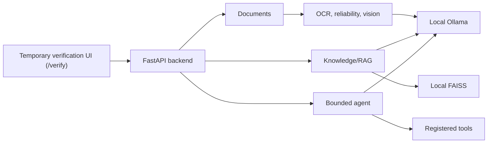

# Sovereign On-Premise Agentic AI Workbench

A local-first SIH 2026 workbench for confidential industrial documents and
workflows. FastAPI coordinates local Ollama models, controlled document
storage, RAG, bounded tools, OCR, and image analysis without requiring cloud
AI services.

## Status

| Phase | Status |
| --- | --- |
| 1 Foundation/local LLM | Verified |
| 2 Document ingestion | Verified |
| 3 Model routing | Complete |
| 4 Local RAG | Verified |
| 5 Agent/tools | Verified manually |
| 6 OCR, vision, reliability | Implemented; awaiting final manual verification |
| 7–10 | Not started |

## Architecture



Services are grouped by domain under `backend/app/services`: `llm`,
`documents`, `knowledge`, and `multimodal`. Routes are thin HTTP boundaries;
schemas define contracts; `tools/` is the fixed execution allow-list.

## Documentation map

| Need | Reference |
| --- | --- |
| Setup, models, and troubleshooting | [Development setup](docs/DEVELOPMENT_SETUP.md) |
| HTTP routes and request shapes | [API reference](docs/API_REFERENCE.md) |
| Components and data flow | [Architecture](docs/ARCHITECTURE.md) |
| Where to change code | [Codebase guide](docs/CODEBASE_GUIDE.md) |
| OCR, reliability, and confirmation | [Phase 6 record](docs/PHASE_6_IMPLEMENTATION.md) |
| Status and planned work | [Development roadmap](docs/DEVELOPMENT_ROADMAP.md) |
| Local-only security posture | [Security and sovereignty](docs/SECURITY_AND_SOVEREIGNTY.md) |
| Historical milestones | [Phase 1](docs/PHASE_1_IMPLEMENTATION.md), [Phase 2](docs/PHASE_2_IMPLEMENTATION.md), [Phase 3](docs/PHASE_3_IMPLEMENTATION.md), [Phase 4](docs/PHASE_4_IMPLEMENTATION.md), [Phase 5](docs/PHASE_5_IMPLEMENTATION.md) |

For current behavior, prefer this README, the API reference, architecture, and
Phase 6 record. Earlier phase files are historical implementation records.

## Quick start (Windows)

```powershell
cd backend
python -m venv venv
.\venv\Scripts\Activate.ps1
pip install -r requirements.txt
Copy-Item .env.example .env
ollama pull qwen3:8b
ollama pull qwen2.5-coder:7b
ollama pull nomic-embed-text
ollama pull llava:7b
uvicorn app.main:app --reload
```

Open the temporary developer verification UI at
`http://127.0.0.1:8000/verify`; Swagger remains at `/docs`.

## Models and configuration

All model names are environment-driven. `.env.example` defines local defaults:
`OLLAMA_MODEL`/`GENERAL_MODEL` (`qwen3:8b`), `CODING_MODEL`
(`qwen2.5-coder:7b`), `EMBEDDING_MODEL` (`nomic-embed-text`), and
`VISION_MODEL` (`llava:7b`). `OLLAMA_BASE_URL` is validated as a loopback URL.
Other relevant settings are `OLLAMA_TIMEOUT_SECONDS`,
`VISION_TIMEOUT_SECONDS`, `MAX_UPLOAD_SIZE_MB`, `RAG_CHUNK_SIZE`,
`RAG_CHUNK_OVERLAP`, `RAG_TOP_K`, `RAG_MIN_SIMILARITY`, `AGENT_MAX_STEPS`,
`OCR_MAX_PAGES`, `OCR_MAX_ATTEMPTS`, and optional `TESSERACT_CMD`.

## Document, reliability, and RAG flow

Supported uploads are PDF, TXT, DOCX, PNG, JPG, and JPEG. Searchable documents
use deterministic parsers. Text-poor PDFs and images can use local Tesseract;
image OCR may make one bounded preprocessed retry. Weak image extraction may
use strict local vision transcription. Important OCR/vision conflicts are never
silently repaired: isolated conflicts become `user_confirmation_required`,
while broad unreadability becomes `reupload_required`.

Final states are `accepted`, `accepted_with_warnings`,
`user_confirmation_required`, `review_required`, and `reupload_required`.
Only the first two are indexable. Confirmation preserves OCR, vision, and
user-confirmed candidates separately with `verification_source=user`.

Accepted text is chunked, embedded locally, persisted in FAISS, retrieved by
cosine similarity, and passed to a routed local model with backend-derived
source metadata.

## Agent and tools

The agent runs a bounded planner → validated decision → fixed tool registry →
observation loop. It blocks repeated normalized calls and returns a safe trace,
not chain-of-thought. Current tools are `knowledge_search`,
`document_metadata`, `document_text`, and `calculator`.

## Progress and verification UI

`POST /api/documents/upload-job` returns a server-generated job immediately;
the background document worker updates safe stage-first job records. Poll
`GET /api/jobs/{job_id}`. Job states are `queued`, `running`,
`waiting_for_user`, `completed`, and `failed`; they are in-memory and clear on
backend restart. The `/verify` cards keep independent progress, response, and
polling state. Upload uses real job polling; vision, indexing, RAG, and agent
requests are currently synchronous and show indeterminate UI status.

## Testing and demo

```powershell
cd backend
.\venv\Scripts\python.exe -m pytest -q
```

For a demo, upload the P-202 inspection image, confirm the extracted `72 °C`
and vibration readings, index an accepted document, ask its bearing
temperature, then run an agent goal. See `docs/PHASE_6_IMPLEMENTATION.md` and
`docs/API_REFERENCE.md` for verification/API detail.

## Reset local development data

[`reset_dev_data.py`](reset_dev_data.py) is a **temporary development-only**
utility for clearing generated documents, extracted text, metadata and
confirmations, and local FAISS/vector artifacts before a clean verification
run. It never runs as part of FastAPI and must not be used in production.

Stop the backend, then run this from the repository root to preview exactly
what would be removed:

```powershell
.\backend\venv\Scripts\python.exe .\reset_dev_data.py --dry-run
```

For interactive cleanup, omit `--dry-run`; the default answer is **No** and
only `y` or `yes` continues:

```powershell
.\backend\venv\Scripts\python.exe .\reset_dev_data.py
```

`--yes` supports deliberate non-interactive local cleanup. All modes require
repository-root execution, reject `APP_ENV=production`, and delete only inside
the configured `backend/data` runtime root. The utility preserves source,
tests, docs, Git data, `.env` files, virtual environments, models, and
configuration. Job records are in memory, so restart the backend to clear them.

## Security and limitations

The system is designed for locally hosted models, embeddings, and storage;
this is not yet a technically enforced air-gap or full Phase 8 security suite.
Only fixed tools execute, uploads receive UUID storage names, jobs reveal no
paths/content/secrets, and Ollama is restricted to loopback configuration.
CPU vision can be slow; job records are not persistent; scanned-PDF vision
fallback and job-based RAG/agent execution are not yet implemented. The
temporary `/verify` page is not the Phase 9 React frontend.
